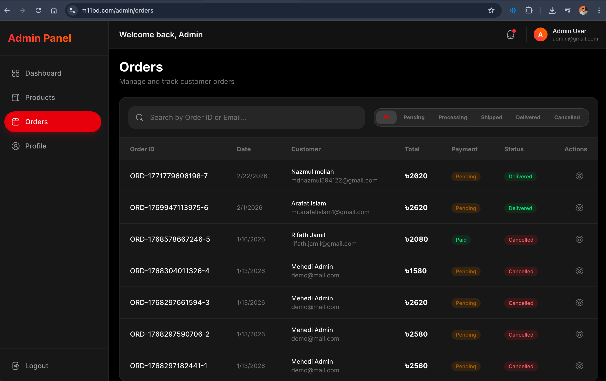
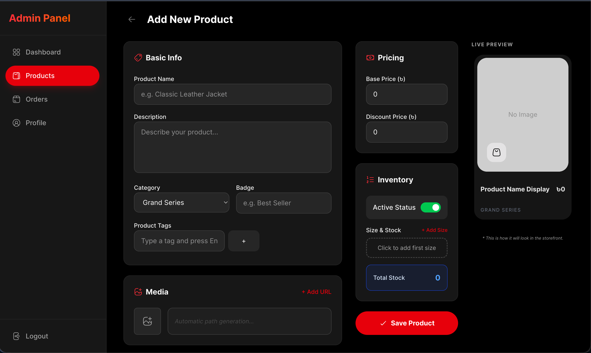
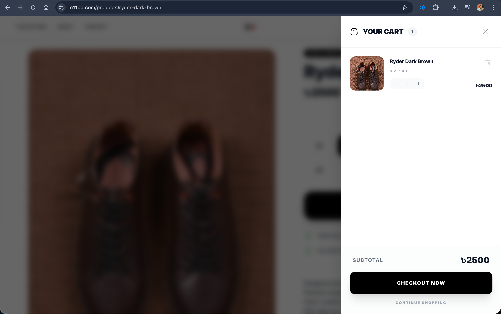

# 👟 M-11 Footwear | Full-Stack E-commerce

A high-end, minimalist e-commerce platform dedicated to handcrafted premium leather footwear. Inspired by the **M-11** aesthetic, this project combines modern software engineering with a luxury user experience

🔗 **[Live Demo](https://m11bd.com/)**

## ✨ Key Highlights

- **Premium UX:** Clean, distraction-free interface focusing on high-quality product imagery
- **Dynamic Collections:** Real-time filtering for New Arrivals, Suede Classics, and Grain Leather editions
- **Performance First:** Optimized for Core Web Vitals using Next.js Image optimization and Server-Side Rendering (SSR)
- **Modern Cart System:** A seamless, persistent shopping experience from product discovery to checkout
- **Lead Generation:** Integrated newsletter subscription system with discount triggers
- **Admin Dashboard:** Intuitive dashboard for managing products, orders, users, and analytics efficiently

## 📸 Project Preview

